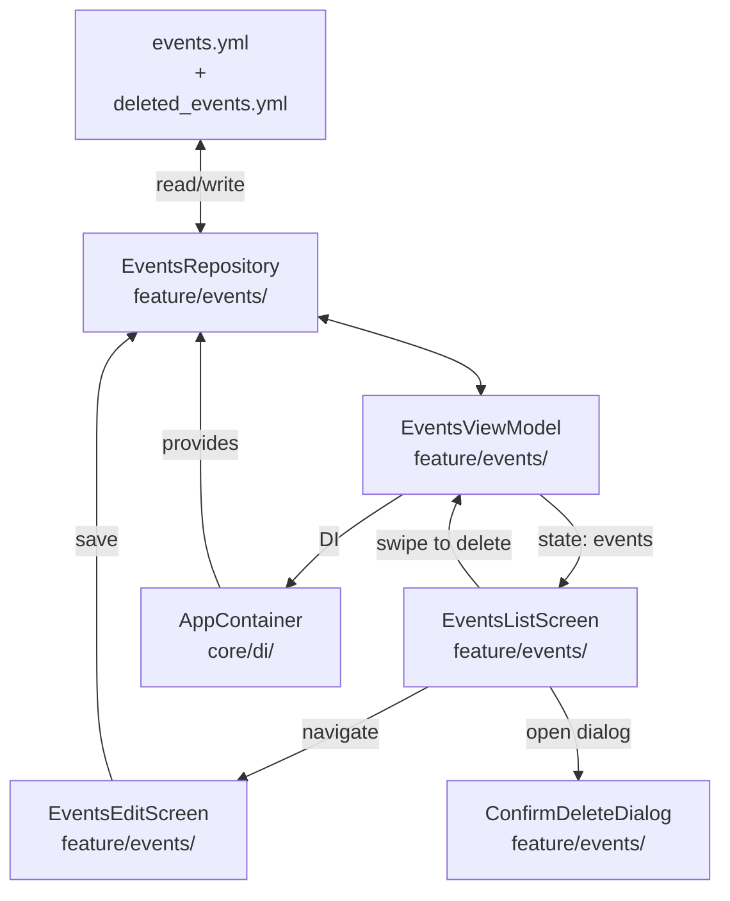

# ReminderApp — Архитектура CRUD с YAML-хранилищем

## Общая концепция

Приложение для записи дел с хранением данных в YAML-файле на устройстве.
В будущем — синхронизация с GitHub через коммиты.

---

## Технический стек

| Компонент | Технология |
|-----------|-----------|
| Язык | Kotlin |
| UI | Jetpack Compose + Material3 |
| Сериализация YAML | `kotlinx-serialization-yaml` |
| Фреймворк сериализации | `kotlinx-serialization` |
| Архитектура | Repository + ViewModel |
| DI | Ручной (Application Container) |

---

## Структура пакетов — Vertical Slice Architecture

```
com.example.reminderapp/
├── ReminderApp.kt              # Application class (контейнер зависимостей)
├── MainActivity.kt             # Точка входа (обновлена)
├── core/
│   ├── model/
│   │   └── Event.kt            # @Serializable data class (общая модель)
│   └── di/
│       └── AppContainer.kt     # DI контейнер (регистрация зависимостей)
├── feature/
│   └── events/                 # ← ВСЁ для фичи Events в одной папке
│       ├── EventsRepository.kt # Интерфейс + реализация (CRUD + YAML I/O)
│       ├── EventsViewModel.kt  # Управление состоянием
│       ├── EventsListScreen.kt # Главный экран (список + SwipeToDismiss + FAB)
│       ├── EventsEditScreen.kt # Экран создания/редактирования
│       ├── EventsItem.kt       # Карточка события (Composable)
│       └── ConfirmDeleteDialog.kt # Диалог подтверждения удаления
└── ui/theme/                   # Тема (Color, Theme, Type) — без изменений
```

### Почему именно так?

| Принцип Vertical Slice | Как реализовано |
|------------------------|----------------|
| 📁 Фича = одна папка | `feature/events/` содержит Screen, ViewModel, Repository, Components |
| 🔌 Core — только общее | Модель `Event` и DI-контейнер — единственное, что переиспользуется |
| 🧹 Нет cross-layer связей | Repository не размазан по `data/repository/`, а лежит рядом с UI |
| 🚀 Легко удалить фичу | Удаляешь папку `feature/events/` — и нет следов |
| ☁️ Готовность к GitHub sync | Следующая фича `feature/sync/` будет такой же самодостаточной папкой |

---

## Архитектура и Data Flow



### Data Flow

1. `AppContainer` создаёт `EventsRepository` (с доступом к YAML-файлам)
2. `EventsViewModel` получает `EventsRepository` через конструктор
3. При запуске ViewModel загружает события из репозитория
4. UI (EventsListScreen) отображает события, подписываясь на StateFlow
5. Пользовательские действия (add/edit/delete/swipe) → ViewModel → Repository → YAML

---

## Формат YAML-файла

Файлы будут храниться в директории: `{context.filesDir}/yamldb/`

| Файл | Назначение |
|------|-----------|
| `events.yml` | Активные события (основной файл) |
| `deleted_events.yml` | Мягкое удаление — архив удалённых событий |

Оба файла читаются/пишутся внутри [`EventsRepository`](app/src/main/java/com/example/reminderapp/feature/events/EventsRepository.kt)

```yaml
events:
  - id: "a1b2c3d4-e5f6-7890-abcd-ef1234567890"
    title: "Встреча с заказчиком"
    description: "Обсуждение нового проекта и сроков"
    date: "2026-05-26"
    time: "14:00"
  - id: "b2c3d4e5-f6a7-8901-bcde-f12345678901"
    title: "Завтрак с командой"
    description: ""
    date: "2026-05-27"
    time: "09:30"
  - id: "c3d4e5f6-a7b8-9012-cdef-123456789012"
    title: "День рождения Алексея"
    description: "Не забыть подарок"
    date: "2026-05-28"
    time: null
```

### Сериализация Event

```kotlin
@Serializable
data class Event(
    val id: String,               // UUID — строка для синхронизации без конфликтов
    val title: String,
    val description: String = "",
    val date: LocalDate,          // кастомный сериализатор -> "yyyy-MM-dd"
    val time: LocalTime? = null   // кастомный сериализатор -> "HH:mm" или null
)
```

```kotlin
@Serializable
data class EventList(
    val events: List<Event>
)
```

Понадобятся кастомные сериализаторы для `LocalDate` и `LocalTime`.

---

### Контейнеры для YAML

```kotlin
@Serializable
data class EventList(
    val events: List<Event>
)
```

Оба файла (`events.yml` и `deleted_events.yml`) используют одну и ту же структуру `EventList`.

---

## Поэтапный план реализации

### Этап 1: YAML-хранилище + отображение данных

**Цель:** Приложение читает события из YAML-файла и отображает их на экране.

| № | Задача | Файлы | Описание |
|---|--------|-------|----------|
| 1.1 | Добавить зависимости | [`build.gradle.kts`](app/build.gradle.kts), [`libs.versions.toml`](gradle/libs.versions.toml) | `kotlinx-serialization` plugin + `kotlinx-serialization-yaml` |
| 1.2 | Модифицировать `Event` (core) | [`core/model/Event.kt`](app/src/main/java/com/example/reminderapp/core/model/Event.kt) | Переместить в core/model, добавить `@Serializable`, кастомные сериализаторы для `LocalDate`/`LocalTime` |
| 1.3 | Создать `EventsRepository` (feature) | Новый файл: `feature/events/EventsRepository.kt` | Весь CRUD + I/O с YAML. Чтение `events.yml`, создание демо-данных при первом запуске |
| 1.4 | Создать `AppContainer` (core) | Новый файл: `core/di/AppContainer.kt` | DI контейнер: создаёт и предоставляет `EventsRepository` |
| 1.5 | Создать `ReminderApp` | Новый файл: `ReminderApp.kt` | Application class — инициализирует `AppContainer` |
| 1.6 | Создать `EventsViewModel` (feature) | Новый файл: `feature/events/EventsViewModel.kt` | Управление состоянием, загрузка событий при старте |
| 1.7 | Создать `EventsListScreen` (feature) | Новый файл: `feature/events/EventsListScreen.kt` | Главный экран: список событий, DateHeader, EmptyState (аналог текущего `EventListScreen`) |
| 1.8 | Создать `EventsItem` (feature) | Новый файл: `feature/events/EventsItem.kt` | Карточка события (аналог текущего `EventItem`) |
| 1.9 | Обновить `MainActivity` | [`MainActivity.kt`](app/src/main/java/com/example/reminderapp/MainActivity.kt) | Получить ViewModel из AppContainer, передать в EventsListScreen |
| 1.10 | Обновить `AndroidManifest` | [`AndroidManifest.xml`](app/src/main/AndroidManifest.xml) | Добавить `android:name=".ReminderApp"` для Application |
| 1.11 | **Удалить** старые файлы | [`EventsReader.kt`](app/src/main/java/com/example/reminderapp/data/reader/EventsReader.kt), [`EventItem.kt`](app/src/main/java/com/example/reminderapp/ui/components/EventItem.kt), [`EventListScreen.kt`](app/src/main/java/com/example/reminderapp/ui/screen/EventListScreen.kt) | Старая архитектура больше не нужна |

**Результат:** Приложение запускается, создаёт `events.yml` с демо-данными, читает их и отображает.

---

### Этап 2: CRUD — Редактирование, мягкое удаление, добавление

**Цель:** Полноценное управление событиями с мягким удалением (soft delete).

| № | Задача | Файлы | Описание |
|---|--------|-------|----------|
| 2.1 | Создать `EventsEditScreen` (feature) | Новый файл: `feature/events/EventsEditScreen.kt` | Отдельный экран с полями: название, описание, дата, время. Кнопки Сохранить/Отмена |
| 2.2 | Создать `ConfirmDeleteDialog` (feature) | Новый файл: `feature/events/ConfirmDeleteDialog.kt` | AlertDialog: "Удалить событие?" с подтверждением |
| 2.3 | Обновить `EventsItem` (feature) | [`EventsItem.kt`](app/src/main/java/com/example/reminderapp/feature/events/EventsItem.kt) | Добавить `onClick` для навигации на редактирование |
| 2.4 | Добавить SwipeToDismiss | [`EventsListScreen.kt`](app/src/main/java/com/example/reminderapp/feature/events/EventsListScreen.kt) | Свайп влево для удаления с `SwipeToDismissBox` + `ConfirmDeleteDialog` |
| 2.5 | Добавить FAB | [`EventsListScreen.kt`](app/src/main/java/com/example/reminderapp/feature/events/EventsListScreen.kt) | FloatingActionButton "+" для создания нового события |
| 2.6 | Реализовать soft delete в `EventsRepository` | [`EventsRepository.kt`](app/src/main/java/com/example/reminderapp/feature/events/EventsRepository.kt) | `delete(id)` — читает events.yml + deleted_events.yml, перемещает событие, перезаписывает оба файла |
| 2.7 | Реализовать add/update в `EventsRepository` | [`EventsRepository.kt`](app/src/main/java/com/example/reminderapp/feature/events/EventsRepository.kt) | add → UUID + запись в events.yml; update → перезапись events.yml |
| 2.8 | Добавить навигацию между экранами | `EventsViewModel`, `EventsListScreen`, `EventsEditScreen` | Навигация через состояние в ViewModel (через `_currentScreen: StateFlow<Screen>`). Без Navigation Component |

**Результат:** Полноценное CRUD-приложение с YAML-хранилищем и soft-delete архивом.

---

### Этап 3: Будущее — GitHub Sync

*Не входит в текущий план, но архитектура закладывается сейчас.*

- Добавить GitHub API-клиент (OkHttp + Retrofit)
- Pull YAML из GitHub репозитория при запуске (если есть интернет)
- Push YAML при каждом изменении (commit)
- Разрешение конфликтов (последняя запись побеждает / merge)

---

## Детали реализации

### Зависимости (libs.versions.toml)

```toml
[versions]
kotlinxSerialization = "1.8.1"

[libraries]
kotlinx-serialization-json = { group = "org.jetbrains.kotlinx", name = "kotlinx-serialization-json", version.ref = "kotlinxSerialization" }
kotlinx-serialization-yaml = { group = "org.jetbrains.kotlinx", name = "kotlinx-serialization-yaml", version.ref = "kotlinxSerialization" }

[plugins]
kotlin-serialization = { id = "org.jetbrains.kotlin.plugin.serialization", version.ref = "kotlin" }
```

### build.gradle.kts (app)

```kotlin
plugins {
    alias(libs.plugins.android.application)
    alias(libs.plugins.kotlin.compose)
    alias(libs.plugins.kotlin.serialization)  // NEW
}

dependencies {
    // ... existing
    implementation(libs.kotlinx.serialization.json)
    implementation(libs.kotlinx.serialization.yaml)
}
```

### EventsRepository (всё в одном файле в feature/events/)

Весь CRUD + YAML I/O в одном месте. Никаких прослоек — всё для фичи Events.

```kotlin
class EventsRepository(private val dir: File) {

    private val activeFile = File(dir, "events.yml")
    private val deletedFile = File(dir, "deleted_events.yml")
    
    private val yaml = Yaml(
        serializersModule = SerializersModule {
            contextual(LocalDate::class, LocalDateSerializer)
            contextual(LocalTime::class, LocalTimeSerializer)
        }
    )

    // ========== READ ==========
    
    fun getAll(): List<Event> {
        if (!activeFile.exists()) createDefaultFiles()
        return readFile(activeFile)
    }

    fun getById(id: String): Event? =
        getAll().find { it.id == id }

    fun getDeleted(): List<Event> {
        if (!deletedFile.exists()) return emptyList()
        return readFile(deletedFile)
    }

    // ========== CREATE / UPDATE ==========

    fun add(event: Event) {
        val events = getAll() + event
        saveActiveEvents(events)
    }

    fun update(event: Event) {
        val events = getAll().map { if (it.id == event.id) event else it }
        saveActiveEvents(events)
    }

    // ========== SOFT DELETE ==========

    fun delete(id: String) {
        val active = getAll()
        val event = active.find { it.id == id } ?: return
        saveActiveEvents(active.filter { it.id != id })
        val deleted = getDeleted() + event
        writeFile(deletedFile, deleted)
    }

    // ========== INTERNALS ==========

    private fun saveActiveEvents(events: List<Event>) {
        val sorted = events.sortedWith(
            compareBy<Event> { it.date }.thenBy { it.time ?: LocalTime.MAX }
        )
        writeFile(activeFile, sorted)
    }

    private fun readFile(file: File): List<Event> =
        yaml.decodeFromString<EventList>(file.readText()).events

    private fun writeFile(file: File, events: List<Event>) {
        file.writeText(yaml.encodeToString(EventList(events)))
    }

    private fun createDefaultFiles() {
        dir.mkdirs()
        saveActiveEvents(generateDefaultEvents())
        writeFile(deletedFile, emptyList())
    }

    private fun generateDefaultEvents(): List<Event> = listOf(
        Event(id = UUID.randomUUID().toString(), title = "...", ...),
        // ... демо-данные
    )
}
```

### Внимание: интерфейс не нужен!

В Vertical Slice Architecture мы не создаём отдельный интерфейс для Repository, если нет нескольких реализаций. `EventsRepository` — конкретный класс, используется напрямую. Если в будущем понадобится облачная версия — тогда и создадим интерфейс.

### EventsViewModel

```kotlin
class EventsViewModel(private val repository: EventsRepository) : ViewModel() {

    private val _events = MutableStateFlow<List<Event>>(emptyList())
    val events: StateFlow<List<Event>> = _events.asStateFlow()

    init {
        loadEvents()
    }

    fun loadEvents() {
        _events.value = repository.getAll()
    }

    fun addEvent(title: String, description: String, date: LocalDate, time: LocalTime?) {
        val event = Event(
            id = UUID.randomUUID().toString(),
            title = title,
            description = description,
            date = date,
            time = time
        )
        repository.add(event)
        loadEvents()
    }

    fun updateEvent(event: Event) {
        repository.update(event)
        loadEvents()
    }

    fun deleteEvent(id: String) {
        repository.delete(id)
        loadEvents()
    }
}
```

---

## Что НЕ входит в этот план (но на будущее)

- GitHub синхронизация
- Уведомления
- Поиск/фильтрация
- Категории и цвета
- Drag-and-drop сортировка
- Pull-to-refresh

---

## Почему kotlinx-serialization-yaml?

1. **Официальная библиотека JetBrains** — часть экосистемы Kotlin
2. **Type-safe** — работает через `@Serializable` аннотации, нет рефлексии
3. **Хорошо работает с ProGuard/R8** — в отличие от snakeyaml (рефлексия)
4. **Минимум бойлерплейта** — один кастомный сериализатор на `LocalDate`/`LocalTime`
