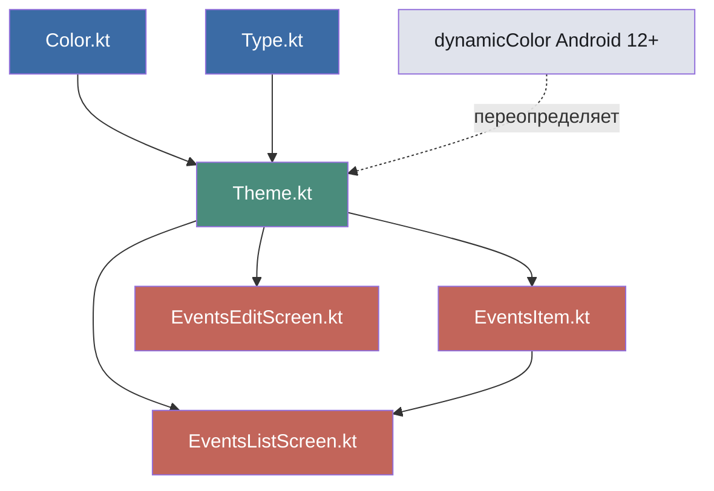

# План модернизации дизайна списка событий

## Диагностика текущего состояния

| Аспект | Текущее | Проблема |
|--------|---------|----------|
| Палитра | `Purple80/40`, `PurpleGrey80/40`, `Pink80/40` | Стандартный шаблон Material3, выглядит как сгенерированный код |
| Карточки | `surfaceVariant`, elevation 1dp | Плоские, сливаются с фоном |
| Типографика | Только `bodyLarge` переопределён | Нет иерархии, всё выглядит одинаково |
| Скругления | Стандартные Material3 | Недостаточно мягкие для современного дизайна |
| Тени | 1dp на карточках | Практически незаметны |
| Empty state | Просто текст | Нет визуальной привлекательности |

---

## Шаг 1 — Новая цветовая палитра (`Color.kt`)

Переход от фиолетовой гаммы к мягкой сине-голубой.

### Светлая тема
```kotlin
// Primary — спокойный синий
val Blue40 = Color(0xFF3B6BA5)       // primary
val Blue80 = Color(0xFFA8C8F0)       // primary (dark theme)
val Blue20 = Color(0xFF1D4A7A)       // onPrimaryContainer
val Blue90 = Color(0xFFD6E6FF)       // primaryContainer

// Secondary — приглушённый бирюзовый
val Teal40 = Color(0xFF4A8C7C)       // secondary
val Teal80 = Color(0xFFA0D8C8)       // secondary (dark)
val Teal90 = Color(0xFFCCEEE2)       // secondaryContainer

// Tertiary — мягкий коралловый акцент
val Coral40 = Color(0xFFC2655A)      // tertiary
val Coral80 = Color(0xFFFFB4A8)      // tertiary (dark)
val Coral90 = Color(0xFFFFDAD4)      // tertiaryContainer

// Neutrals — тёплые серые
val Neutral99 = Color(0xFFFCFCFF)    // background
val Neutral95 = Color(0xFFF1F3F9)    // surfaceVariant
val Neutral90 = Color(0xFFE0E3EC)    // surfaceVariant darker
val Neutral10 = Color(0xFF1A1C20)    // onBackground
```

### Тёмная тема
```kotlin
val Neutral6 = Color(0xFF0F1115)     // background
val Neutral12 = Color(0xFF1A1D23)    // surface
val Neutral20 = Color(0xFF2E3239)    // surfaceVariant
val Neutral90 = Color(0xFFE0E3EC)    // onBackground
```

---

## Шаг 2 — Типографика (`Type.kt`)

Полная шкала для визуальной иерархии:

| Стиль | Размер | Weight | LineHeight | Назначение |
|-------|--------|--------|------------|------------|
| `headlineLarge` | 28sp | Bold | 36sp | Заголовок экрана |
| `headlineSmall` | 24sp | SemiBold | 32sp | Число даты в карточке |
| `titleLarge` | 20sp | SemiBold | 28sp | Заголовок TopAppBar |
| `titleMedium` | 16sp | SemiBold | 24sp | Название события |
| `titleSmall` | 14sp | Bold | 20sp | Заголовок группы дат |
| `bodyLarge` | 16sp | Normal | 24sp | Основной текст |
| `bodyMedium` | 14sp | Normal | 20sp | Описание события |
| `labelLarge` | 14sp | Medium | 20sp | Время, метки |
| `labelSmall` | 11sp | Medium | 16sp | Вспомогательный текст |

---

## Шаг 3 — Тема (`Theme.kt`)

Полная настройка `lightColorScheme()` и `darkColorScheme()`:

```kotlin
private val LightColorScheme = lightColorScheme(
    primary = Blue40,
    onPrimary = Color.White,
    primaryContainer = Blue90,
    onPrimaryContainer = Blue20,
    secondary = Teal40,
    onSecondary = Color.White,
    secondaryContainer = Teal90,
    onSecondaryContainer = Color(0xFF0D2B21),
    tertiary = Coral40,
    onTertiary = Color.White,
    tertiaryContainer = Coral90,
    onTertiaryContainer = Color(0xFF3E110C),
    background = Neutral99,
    onBackground = Neutral10,
    surface = Color.White,
    onSurface = Neutral10,
    surfaceVariant = Neutral95,
    onSurfaceVariant = Color(0xFF44474E),
    outline = Color(0xFF74777F),
    error = Color(0xFFBA1A1A),
    errorContainer = Color(0xFFFFDAD6),
    onErrorContainer = Color(0xFF410002)
)
```

**Важно**: dynamicColor оставить `true` для Android 12+ — тогда системные цвета Material You переопределят кастомную палитру автоматически.

---

## Шаг 4 — Карточка события (`EventsItem.kt`)

### Изменения:

1. **Увеличить скругление**: `shape = RoundedCornerShape(16.dp)` вместо дефолтного
2. **Фон**: `surface` (белый) вместо `surfaceVariant` (серый)
3. **Тень**: `elevation = 2.dp` (вместо 1dp), плюс добавить `tonalElevation` для эффекта приподнятости
4. **Цветной акцент слева**: добавить `Box` шириной 4dp с цветом `primary`, скруглённый слева — маркер визуальной иерархии
5. **Отступы**: padding внутри карточки увеличить до 16dp по горизонтали и 14dp по вертикали
6. **Разделитель**: тонкая линия `outlineVariant` между заголовком и описанием (опционально, если есть описание)

### Структура карточки:
```
┌──────────────────────────────────┐
│ ▌  Встреча с заказчиком      15 │
│ ▌  Обсуждение проекта           │
│ ▌  14:00                        │
└──────────────────────────────────┘
  ↑                              ↑
  цветной акцент          число даты
  (primary, 4dp)          (headlineSmall)
```

---

## Шаг 5 — Экран списка (`EventsListScreen.kt`)

### Изменения:

1. **TopAppBar**:
   - Добавить `containerColor = MaterialTheme.colorScheme.background`
   - Убрать тень/границу — пусть сливается с фоном для лёгкости
   - Крупнее заголовок: `headlineLarge`

2. **DateHeader**:
   - Добавить минималистичный серый разделитель слева от текста
   - Чуть больше отступ сверху (20dp)
   - Использовать `titleSmall`, цвет `onSurfaceVariant` (не primary — слишком ярко)

3. **Empty state**:
   - Добавить иконку (например, `Icons.Outlined.EventNote` или `Icons.Outlined.Celebration`) размером 64dp
   - Текст «Нет событий» с подписью «Нажмите + чтобы добавить»
   - Цвет `onSurfaceVariant`, прозрачность 0.6

4. **Loading state**:
   - Оставить `CircularProgressIndicator`, но добавить текст «Загрузка...»

5. **FAB**:
   - Оставить без изменений (уже хорошо)
   - Опционально: увеличить скругление до `shape = RoundedCornerShape(16.dp)`

6. **Свайп-фоны**:
   - «На завтра»: `primaryContainer` + иконка `→`
   - «Удалить»: `errorContainer` + иконка корзины
   - Добавить иконки рядом с текстом для наглядности

7. **Отступы LazyColumn**:
   - Горизонтальные: 16dp (уже хорошо)
   - Вертикальный spacing: 12dp между карточками (вместо 8dp)

---

## Шаг 6 — Экран редактирования (`EventsEditScreen.kt`)

### Изменения:

1. **OutlinedTextField**: использовать `shape = RoundedCornerShape(12.dp)` для более мягких полей ввода
2. **Button**: `shape = RoundedCornerShape(12.dp)`, высота 48dp
3. **Цвета**: не требуют изменений — автоматически подхватят новую палитру из темы

---

## Шаг 7 — Проверка согласованности

После всех изменений пройтись по экранам:
- [ ] EventsListScreen — светлый, воздушный список
- [ ] EventsItem — карточки с акцентом
- [ ] EventsEditScreen — поля ввода и кнопки
- [ ] DeletedEventsScreen — если есть расхождения
- [ ] SettingsScreen — если есть расхождения

---

## Сводка ключевых метрик

| Параметр | Было | Стало |
|----------|------|-------|
| Скругление карточек | ~12dp (default) | 16dp |
| Тень карточек | 1dp | 2dp + tonal |
| Цвет карточек | `surfaceVariant` (серый) | `surface` (белый) |
| Горизонтальный акцент | Нет | Полоса 4dp, primary |
| Отступ между карточками | 8dp | 12dp |
| Цвет заголовков дат | `primary` | `onSurfaceVariant` |
| Empty state | Только текст | Иконка + текст + подсказка |
| Свайп-лейблы | Только текст | Текст + иконка |

---

## Mermaid-диаграмма архитектуры изменений


