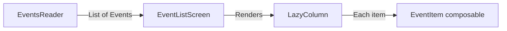

# Event List App - UI Plan

## Overview
A minimal personal calendar app that displays events as a flat list sorted by date (closest first).

## Tech Stack
- **Language**: Kotlin
- **UI Framework**: Jetpack Compose + Material3
- **Minimum SDK**: 24 (Android 7.0)
- **Build System**: Gradle with Kotlin DSL

---

## Architecture

### Package Structure

```
com.example.reminderapp/
├── MainActivity.kt
├── data/
│   ├── model/
│   │   └── Event.kt
│   └── reader/
│       └── EventsReader.kt
├── ui/
│   ├── screen/
│   │   └── EventListScreen.kt
│   └── components/
│       └── EventItem.kt
└── theme/
    ├── Color.kt
    ├── Theme.kt
    └── Type.kt
```

### Data Flow



- [`EventsReader`](app/src/main/java/com/example/reminderapp/data/reader/EventsReader.kt) — provides a list of stub [`Event`](app/src/main/java/com/example/reminderapp/data/model/Event.kt) objects sorted by date
- [`EventListScreen`](app/src/main/java/com/example/reminderapp/ui/screen/EventListScreen.kt) — the main composable that receives events and displays them
- [`EventItem`](app/src/main/java/com/example/reminderapp/ui/components/EventItem.kt) — a single row in the list showing event info

---

## Data Model

### [`Event` data class](app/src/main/java/com/example/reminderapp/data/model/Event.kt)

| Field | Type | Description |
|-------|------|-------------|
| `id` | `Long` | Unique identifier |
| `title` | `String` | Event title |
| `description` | `String` | Optional description |
| `date` | `LocalDate` | Event date (year-month-day) |
| `time` | `LocalTime?` | Optional time |

---

## EventsReader (Stub)

A singleton object [`EventsReader`](app/src/main/java/com/example/reminderapp/data/reader/EventsReader.kt) with a single function:

```kotlin
fun getEvents(): List<Event>
```

Returns a hardcoded list of sample events, sorted by `date` ascending (closest first). Sample data includes:
- Events in the past (already passed)
- Events today
- Events in the near future
- Events further ahead

---

## UI Design

### Screen Layout

```
┌─────────────────────────────┐
│         Event List          │  ← TopAppBar title
├─────────────────────────────┤
│ 📅 15 May 2026  (today)     │  ← Date header (if multiple events share date)
│   ┌───────────────────────┐ │
│   │ 🎂 Birthday Party     │ │  ← EventItem card
│   │   at 18:00            │ │
│   │   Restaurant booking  │ │
│   └───────────────────────┘ │
│   ┌───────────────────────┐ │
│   │ 🏥 Dentist Appt       │ │  ← EventItem card
│   │   at 10:30            │ │
│   └───────────────────────┘ │
├─────────────────────────────┤
│ 📅 20 May 2026              │  ← Date header
│   ┌───────────────────────┐ │
│   │ ✈️ Flight to Paris    │ │
│   │   All day             │ │
│   └───────────────────────┘ │
├─────────────────────────────┤
│ 📅 1 June 2026              │  ← Date header
│   ┌───────────────────────┐ │
│   │ 📝 Project Deadline   │ │
│   └───────────────────────┘ │
└─────────────────────────────┘
```

### Components

#### 1. [`EventItem`](app/src/main/java/com/example/reminderapp/ui/components/EventItem.kt)
- Card-based layout with rounded corners and subtle elevation
- Displays:
  - **Title** — bold, primary text color
  - **Time** — secondary text, only if `time != null`
  - **Description** — optional, tertiary text below title
- Clickable (with ripple effect) — placeholder for future navigation

#### 2. [`EventListScreen`](app/src/main/java/com/example/reminderapp/ui/screen/EventListScreen.kt)
- [`Scaffold`](https://developer.android.com/develop/ui/compose/components/scaffold) with a [`TopAppBar`](https://developer.android.com/develop/ui/compose/components/app-bars#top-app-bar) titled "Events"
- [`LazyColumn`](https://developer.android.com/develop/ui/compose/lists#lazy-column) to efficiently render the list
- Date separator headers between groups of events on the same date
- If list is empty, show a placeholder text "No events yet"

### 3. [`MainActivity`](app/src/main/java/com/example/reminderapp/MainActivity.kt) Changes
- Remove the default `Greeting` composable
- Call [`EventListScreen`](app/src/main/java/com/example/reminderapp/ui/screen/EventListScreen.kt) with events from [`EventsReader`](app/src/main/java/com/example/reminderapp/data/reader/EventsReader.kt)
- Keep `enableEdgeToEdge()` and `ReminderAppTheme`

---

## Implementation Steps

1. **Create [`Event`](app/src/main/java/com/example/reminderapp/data/model/Event.kt)** — data class with fields above
2. **Create [`EventsReader`](app/src/main/java/com/example/reminderapp/data/reader/EventsReader.kt)** — singleton with `getEvents()` returning stub data sorted by date
3. **Create [`EventItem`](app/src/main/java/com/example/reminderapp/ui/components/EventItem.kt)** — card composable for a single event
4. **Create [`EventListScreen`](app/src/main/java/com/example/reminderapp/ui/screen/EventListScreen.kt)** — main screen with lazy list, date headers, and empty state
5. **Update [`MainActivity`](app/src/main/java/com/example/reminderapp/MainActivity.kt)** — wire everything together, remove default greeting composable

---

## Future Considerations (Not Implemented Now)

- Room database for persistent storage
- Add/Edit/Delete events
- Calendar view (month grid)
- Notifications for upcoming events
- Swipe to delete
- Pull to refresh
- Search/filter
- Category colors
