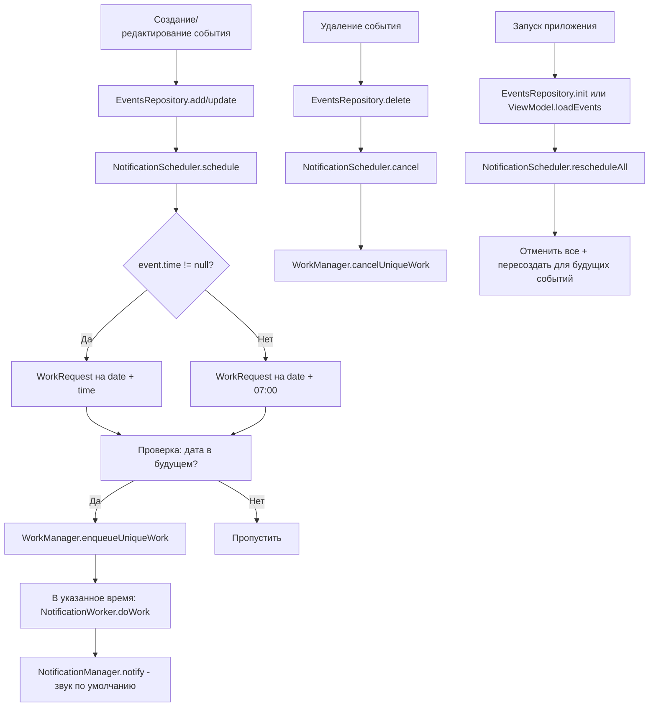

# План реализации: Система уведомлений со звуком

## Цель

Добавить стандартные уведомления со звуком для событий:
- Если у события указано время → уведомление в точное время в указанную дату
- Если у события нет времени (весь день) → уведомление в 7:00 утра в указанную дату
- События, дата которых уже прошла — уведомления не планируются

## Используемые технологии

- **Android WorkManager** — надёжное планирование задач (переживает перезагрузки, doze-режим)
- **NotificationManager + NotificationChannel** — показ системных уведомлений
- **CoroutineWorker** — фоновая работа для показа уведомления

## Архитектура

```
AppContainer
  └── NotificationScheduler(context)
        └── WorkManager
              └── NotificationWorker (CoroutineWorker)
                    └── NotificationManager.notify()

EventsRepository
  └── NotificationScheduler (внедряется через конструктор)
```

### Диаграмма потока



---

## Пошаговая реализация

### Шаг 1: Добавить зависимость WorkManager

**Файлы для изменения:**
- [`gradle/libs.versions.toml`](gradle/libs.versions.toml)
- [`app/build.gradle.kts`](app/build.gradle.kts)

**Действия:**
1. В `[versions]` добавить: `workRuntimeKtx = "2.10.0"`
2. В `[libraries]` добавить:
   ```
   androidx-work-runtime-ktx = { group = "androidx.work", name = "work-runtime-ktx", version.ref = "workRuntimeKtx" }
   ```
3. В `app/build.gradle.kts` в блок `dependencies` добавить:
   ```kotlin
   implementation(libs.androidx.work.runtime.ktx)
   ```

---

### Шаг 2: Добавить разрешения в AndroidManifest.xml

**Файл:** [`app/src/main/AndroidManifest.xml`](app/src/main/AndroidManifest.xml)

**Действия:**
Добавить перед `<application>` три разрешения:
```xml
<uses-permission android:name="android.permission.SCHEDULE_EXACT_ALARM" />
<uses-permission android:name="android.permission.POST_NOTIFICATIONS" />
<uses-permission android:name="android.permission.RECEIVE_BOOT_COMPLETED" />
```

> Примечание: `POST_NOTIFICATIONS` требует runtime-запроса на Android 13+, но для минимальной реализации можно пока пропустить runtime-запрос (уведомления будут работать, если пользователь не отключил их вручную в настройках).

---

### Шаг 3: Инициализация NotificationChannel в ReminderApp

**Файл:** [`app/src/main/java/com/example/reminderapp/ReminderApp.kt`](app/src/main/java/com/example/reminderapp/ReminderApp.kt)

**Действия:**
В методе `onCreate()` до создания `AppContainer` добавить вызов приватного метода `createNotificationChannel()`:
```kotlin
private fun createNotificationChannel() {
    val channel = NotificationChannel(
        CHANNEL_ID,
        "Напоминания о событиях",
        NotificationManager.IMPORTANCE_DEFAULT
    ).apply {
        description = "Уведомления о запланированных событиях"
        setSound(
            RingtoneManager.getDefaultUri(RingtoneManager.TYPE_NOTIFICATION),
            AudioAttributes.Builder()
                .setUsage(AudioAttributes.USAGE_NOTIFICATION)
                .build()
        )
    }
    val manager = getSystemService(NotificationManager::class.java)
    manager.createNotificationChannel(channel)
}

companion object {
    const val CHANNEL_ID = "event_reminder"
}
```

---

### Шаг 4: Создать NotificationWorker

**Новый файл:** `app/src/main/java/com/example/reminderapp/core/notification/NotificationWorker.kt`

**Содержание:**
- `CoroutineWorker`, параметры: `Context`, `WorkerParameters`
- Читает из `inputData`: `eventTitle` (String), `eventDescription` (String), `eventId` (String)
- Создаёт уведомление:
  - Канал: `event_reminder`
  - Заголовок: `eventTitle`
  - Текст: `eventDescription` (или "Без описания" если пусто)
  - Маленькая иконка: `ic_app_icon` (из res/drawable)
  - `setAutoCancel(true)`
  - `setSound` — системный звук уведомления по умолчанию
- Вызывает `notificationManager.notify(eventId.hashCode(), notification)`
- Возвращает `Result.success()`

---

### Шаг 5: Создать NotificationScheduler

**Новый файл:** `app/src/main/java/com/example/reminderapp/core/notification/NotificationScheduler.kt`

**Поля:**
- `context: Context`
- `workManager: WorkManager`

**Методы:**

1. **`schedule(event: Event)`**
   - Определить дату-время триггера:
     ```kotlin
     val triggerDateTime = if (event.time != null) {
         event.date.atTime(event.time)
     } else {
         event.date.atTime(LocalTime.of(7, 0))
     }
     ```
   - Если `triggerDateTime` в прошлом → выйти (не планировать)
   - Создать `OneTimeWorkRequestBuilder<NotificationWorker>()`
     - `setInitialDelay` = разница между `triggerDateTime.atZone(ZoneId.of("Europe/Samara")).toInstant()` и `System.currentTimeMillis()`
     - `setInputData` = workDataOf("eventId" to event.id, "eventTitle" to event.title, "eventDescription" to event.description)
     - `addTag(WORK_TAG_PREFIX + event.id)`
   - `workManager.enqueueUniqueWork(event.id, ExistingWorkPolicy.REPLACE, request)`

2. **`cancel(eventId: String)`**
   - `workManager.cancelUniqueWork(eventId)`

3. **`rescheduleAll(events: List<Event>)`**
   - `workManager.cancelAllWorkByTag(WORK_TAG_PREFIX)` — или отменить все уникальные работы
   - Для каждого `event` вызвать `schedule(event)`

**Константы:**
- `WORK_TAG_PREFIX = "event_reminder_"`

---

### Шаг 6: Интегрировать NotificationScheduler в AppContainer

**Файл:** [`app/src/main/java/com/example/reminderapp/core/di/AppContainer.kt`](app/src/main/java/com/example/reminderapp/core/di/AppContainer.kt)

**Действия:**
- Создать `notificationScheduler` как `lazy { NotificationScheduler(context) }`
- Передать `notificationScheduler` в конструктор `EventsRepository`

```kotlin
class AppContainer(context: Context) {
    private val storageDir: File = File(context.filesDir, "yamldb")

    val notificationScheduler: NotificationScheduler by lazy {
        NotificationScheduler(context)
    }

    val eventsRepository: EventsRepository by lazy {
        EventsRepository(storageDir, notificationScheduler)
    }
}
```

---

### Шаг 7: Интегрировать вызовы NotificationScheduler в EventsRepository

**Файл:** [`app/src/main/java/com/example/reminderapp/feature/events/EventsRepository.kt`](app/src/main/java/com/example/reminderapp/feature/events/EventsRepository.kt)

**Действия:**
1. Добавить параметр `private val scheduler: NotificationScheduler` в конструктор
2. В методе `add(event)` → добавить `scheduler.schedule(event)`
3. В методе `update(event)` → добавить `scheduler.schedule(event)`
4. В методе `delete(id)` → добавить `scheduler.cancel(id)`
5. В методе `moveToTomorrow(id)` → после копирования события получить его новый и вызвать `scheduler.schedule(updatedEvent)` (нужно найти обновлённое событие)
6. В методе `restore(id)` → добавить `scheduler.schedule(event)`
7. В методе `ensureFilesExist()` → после `writeEvents(activeFile, generateDemoEvents())` добавить планирование уведомлений для всех созданных демо-событий

> Важно: вызовы `scheduler.schedule/cancel` должны идти ПОСЛЕ успешной записи в YAML, чтобы обеспечить консистентность. Но в текущем коде методы не возвращают ошибок, поэтому можно вызывать сразу после.

---

### Шаг 8: rescheduleAll при инициализации

**Файлы:**
- [`EventsRepository.kt`](app/src/main/java/com/example/reminderapp/feature/events/EventsRepository.kt) — в `getAll()` добавить `scheduler.rescheduleAll(events)` после чтения
- Либо вынести в публичный метод `rescheduleNotifications()` и вызывать его из `EventsViewModel.loadEvents()`

**Рекомендация:** добавить публичный метод `rescheduleAllNotifications()` в `EventsRepository`, который:
```kotlin
fun rescheduleAllNotifications() {
    scheduler.rescheduleAll(getAll())
}
```
И вызывать его в `EventsViewModel.loadEvents()` после загрузки событий:
```kotlin
fun loadEvents() {
    viewModelScope.launch {
        _isLoading.value = true
        try {
            _events.value = repository.getAll()
            repository.rescheduleAllNotifications()
            _error.value = null
        } catch (e: Exception) { ... }
        finally { _isLoading.value = false }
    }
}
```

---

## Сводка изменений по файлам

| Файл | Действие |
|------|----------|
| `gradle/libs.versions.toml` | Изменить — добавить workRuntimeKtx |
| `app/build.gradle.kts` | Изменить — добавить implementation |
| `app/src/main/AndroidManifest.xml` | Изменить — добавить 3 permission |
| `app/src/main/.../ReminderApp.kt` | Изменить — инициализация канала |
| `app/src/main/.../core/notification/NotificationWorker.kt` | **Создать** |
| `app/src/main/.../core/notification/NotificationScheduler.kt` | **Создать** |
| `app/src/main/.../core/di/AppContainer.kt` | Изменить — добавить NotificationScheduler |
| `app/src/main/.../feature/events/EventsRepository.kt` | Изменить — интеграция scheduler |
| `app/src/main/.../feature/events/EventsViewModel.kt` | Изменить — rescheduleAll при loadEvents |

## Допущения

1. **Звук системный по умолчанию** (не кастомный .mp3/.ogg)
2. **События в прошлом не уведомляются** — проверка `triggerDateTime.isBefore(LocalDateTime.now())`
3. **Часовой пояс:** `Europe/Samara` (UTC+4) — используется при конвертации LocalDateTime в Instant
4. **Runtime-запрос POST_NOTIFICATIONS** — пока не добавляется, уведомления работают пока пользователь не отключил их вручную
