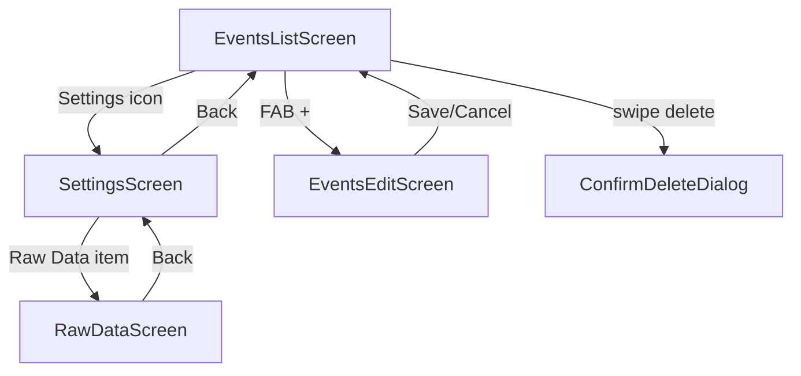

# Settings Page — План реализации

## Цель

Создать страницу "Настроек" (Settings/Menu), куда в будущем можно будет добавлять новые разделы. На первом этапе — один раздел "Отладка", в который переносится существующий экран RawData.

---

## Текущая архитектура навигации

```
MainActivity.kt (навигационный хаб)
├── isEditScreenVisible == true  → EventsEditScreen
├── isRawDataVisible == true    → RawDataScreen
└── else                         → EventsListScreen
                                    └── [Code иконка] → viewModel.openRawData()
```

## Целевая архитектура навигации

```
MainActivity.kt (навигационный хаб)
├── isEditScreenVisible == true  → EventsEditScreen
├── isRawDataVisible == true    → RawDataScreen
├── isSettingsVisible == true   → SettingsScreen
│                                   └── Раздел "Отладка"
│                                        └── Пункт "Raw Data" → viewModel.openRawData()
└── else                         → EventsListScreen
                                    └── [Settings иконка] → viewModel.openSettings()
```

---

## Диаграмма навигации



---

## Детали реализации

### 1. Новый файл: `SettingsScreen.kt`

**Путь:** `app/src/main/java/com/example/reminderapp/feature/settings/SettingsScreen.kt`

Структура экрана:
- `Scaffold` с `CenterAlignedTopAppBar` (заголовок "Настройки", кнопка назад)
- Список разделов, каждый раздел:
  - Заголовок раздела (например, "Отладка")
  - Пункты раздела — кликабельные строки с иконкой и названием

Параметры композиции:
```kotlin
@Composable
fun SettingsScreen(
    onNavigateToRawData: () -> Unit,
    onBack: () -> Unit,
    modifier: Modifier = Modifier
)
```

Первый раздел — "Отладка" с одним пунктом:
- Иконка: `Icons.Default.Code` (или `BugReport`)
- Название: "Raw Data" / "Сырые данные"
- Действие: `onNavigateToRawData()`

### 2. Изменения в `EventsViewModel.kt`

Добавить:
```kotlin
private val _isSettingsVisible = MutableStateFlow(false)
val isSettingsVisible: StateFlow<Boolean> = _isSettingsVisible.asStateFlow()

fun openSettings() {
    _isSettingsVisible.value = true
}

fun closeSettings() {
    _isSettingsVisible.value = false
}
```

### 3. Изменения в `MainActivity.kt`

- Добавить `import` для `SettingsScreen`
- Добавить чтение состояния `isSettingsVisible`:
  ```kotlin
  val isSettingsVisible by viewModel.isSettingsVisible.collectAsState()
  ```
- Обновить `BackHandler`:
  ```kotlin
  BackHandler(enabled = isEditScreenVisible || isRawDataVisible || isSettingsVisible) {
      when {
          isEditScreenVisible -> viewModel.closeEditScreen()
          isRawDataVisible -> viewModel.closeRawData()
          isSettingsVisible -> viewModel.closeSettings()
      }
  }
  ```
- Добавить ветку в `when`:
  ```kotlin
  isSettingsVisible -> {
      SettingsScreen(
          onNavigateToRawData = { viewModel.openRawData() },
          onBack = { viewModel.closeSettings() },
          modifier = Modifier.fillMaxSize()
      )
  }
  ```

**Важно:** При открытии RawData из Settings, нужно ли закрывать Settings? 
- Вариант А: Settings остаётся в back-stack'е (RawData поверх Settings). Тогда Back на RawData возвращает в Settings.
- Вариант Б: Settings закрывается при переходе на RawData. Тогда Back на RawData возвращает в EventsList.

**Рекомендация: Вариант А** — более естественная навигация. Достигается тем, что мы НЕ вызываем `closeSettings()` при открытии RawData. Оба флага (`isSettingsVisible` и `isRawDataVisible`) могут быть `true` одновременно, и приоритет в `when` должен быть у `isRawDataVisible` (проверяется раньше).

Порядок проверки в `when`:
```kotlin
when {
    isEditScreenVisible -> EventsEditScreen(...)
    isRawDataVisible -> RawDataScreen(...)     // выше чем Settings
    isSettingsVisible -> SettingsScreen(...)
    else -> EventsListScreen(...)
}
```

При закрытии RawData (`closeRawData()`) — мы возвращаемся на Settings (он всё ещё видим).

### 4. Изменения в `EventsListScreen.kt`

В блоке `actions` у `CenterAlignedTopAppBar`:

**Было:**
```kotlin
actions = {
    IconButton(onClick = { viewModel.openRawData() }) {
        Icon(
            imageVector = Icons.Default.Code,
            contentDescription = "Raw Data"
        )
    }
}
```

**Стало:**
```kotlin
actions = {
    IconButton(onClick = { viewModel.openSettings() }) {
        Icon(
            imageVector = Icons.Default.Settings,
            contentDescription = "Настройки"
        )
    }
}
```

Нужно добавить import:
```kotlin
import androidx.compose.material.icons.filled.Settings
```

Убрать import `Icons.Default.Code` (если больше нигде не используется).

---

## Порядок выполнения

1. **Создать** `SettingsScreen.kt` в `feature/settings/`
2. **Обновить** `EventsViewModel.kt` — добавить состояние и методы для Settings
3. **Обновить** `MainActivity.kt` — добавить ветку SettingsScreen
4. **Обновить** `EventsListScreen.kt` — заменить иконку и навигацию

---

## Влияние на RawDataScreen

`RawDataScreen.kt` **не требует изменений**. Он продолжит получать `onBack` callback, но теперь этот callback будет возвращать на SettingsScreen (через `viewModel.closeRawData()`), а не напрямую на EventsListScreen.

---

## Иконки Material3

| Иконка | Назначение |
|--------|-----------|
| `Icons.Default.Settings` | Кнопка настроек в EventsListScreen |
| `Icons.Default.Code` | Пункт "Raw Data" в разделе "Отладка" (SettingsScreen) |
| `Icons.AutoMirrored.Filled.ArrowBack` | Кнопка "Назад" в SettingsScreen |
